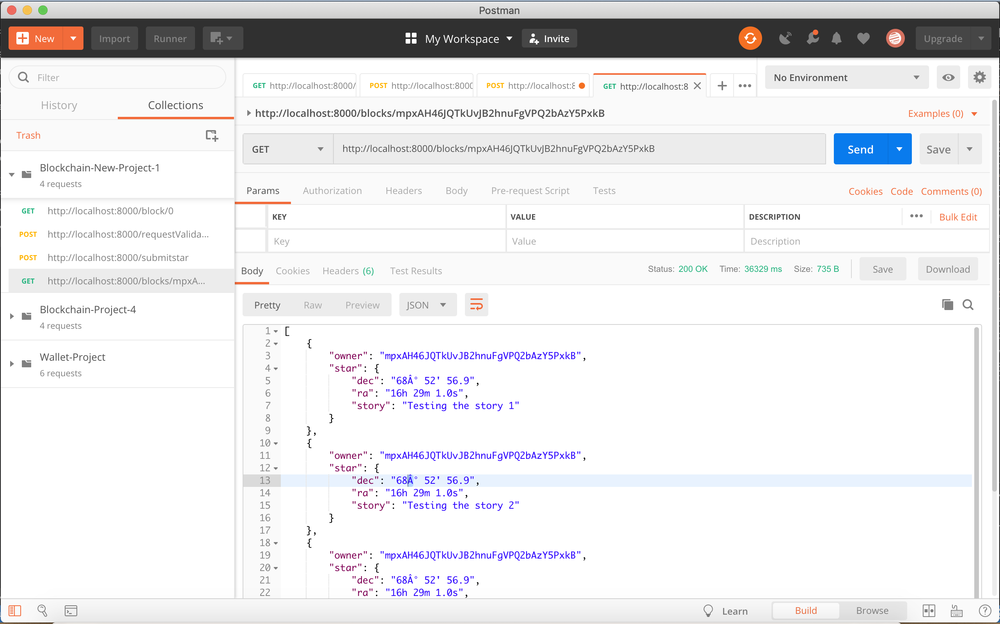

# Star Notary

## How to test your application functionality?
To test your application I recommend you to use POSTMAN, this tool will help you to make the requests to the API.

1. Run your application using the command below.

```
node app.js
```

2. You should see in your terminal a message indicating that the server is listening in port 8000:

```
Server Listening for port: 8000
```

3. To make sure your application is working fine and it creates the Genesis Block you can use POSTMAN to request the Genesis block:


4. Make your first request of ownership sending your wallet address:


5. Sign the message with your Wallet:


6. Submit your Star


7. Retrieve Stars owned by me



## Other related information

Truffle 

```
v5.1.13
```
Openzeppelin

```
v2.4.0
```


ERC-721 Token Name

```
Test Star
```

ERC-721 Token Symbol

```
TS
```

Token Address on the Rinkeby Network

```
0xE50248e47289d9B6F41C8bda419cF719FEB2Ee18
```

Transaction Hash

```
0xfdb7693c4d045b301c747fbdabe58e5307efe266bc783365faa2040a312cf2f2
```
